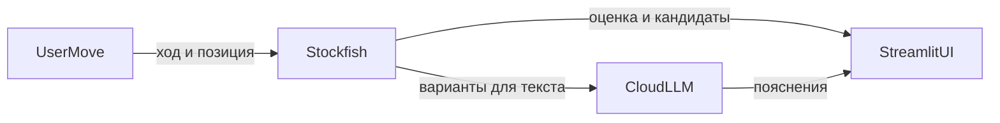

# Chess Coach — концепция проекта (MVP)

## Идея продукта

**Chess Coach** — локальный учебный помощник: пользователь играет против сильного движка и после ответа движка на ход человека видит **несколько сильных продолжений из расчёта** и **короткое объяснение** к ним, сформулированное для человека. Ценность — связать **объективную силу вариантов** (оценки и ходы от движка) с **понятным языком**, не подменяя шахматную логику моделью языка.

## Принцип «истина от движка»

Все **легальность позиции**, **ходы движка**, **числовые и шахматные оценки** и **список кандидатов для показа** исходят только из **Stockfish**. Модель **LLM** получает **уже подготовленное описание** посчитанных линий (ходы, оценки, при необходимости краткая нотация продолжения) и лишь **переводит** это в связный текст: идеи, типичные мотивы, сравнение вариантов — **без изобретения альтернативных ходов** и без пересчёта позиции.

Такое разделение снижает риск «галлюцинаций» в шахматной части: если формулировка LLM неясна, ориентиром остаются данные **Stockfish**.

## Поток данных (логический)

Пользователь вводит ход в интерфейсе **Streamlit**; приложение передаёт позицию и команду в **Stockfish** по **UCI**. Движок возвращает обновлённую позицию, оценку и набор сильных продолжений. Эти структурированные результаты показываются в UI и **одновременно** передаются в запрос к **облачному LLM API** для генерации коротких пояснений. Ответ LLM снова выводится в **Streamlit** рядом с числовыми и шахматными данными от движка.

## Границы и риски

- **LLM** может неточно сформулировать идею или упустить нюанс; пользователь **проверяет смысл** по ходам и оценкам **Stockfish**.
- Ключи и параметры **облачного LLM API** хранятся **локально** (например переменные окружения); в концепции MVP **нет** требований к публикации сервиса в интернете.
- Объём и глубина объяснений ограничиваются разумной длиной ответа модели и размером передаваемого контекста — без обещания «полного курса дебютов» в первой версии.

## Что намеренно отложено (после MVP)

Регистрация, персистентное хранение партий, **PGN**, мультиплеер, деплой как обязательная цель, продвинутые тренировочные режимы и прочая функциональность **не входят** в первую версию; при необходимости их можно рассматривать отдельными этапами без фиксации сроков в данном документе.
