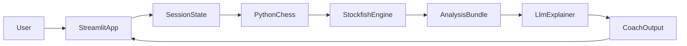

# Пошаговый план реализации и демонстрации

## Назначение документа
Этот файл - основной рабочий план для меня и других агентов. Его задача - удерживать реализацию в узком, надежном и демонстрационно сильном scope.

Если в процессе появится новая идея, она добавляется только в том случае, если не угрожает базовому сценарию live-demo.

## Главный приоритет
Нужно собрать не "полноценный шахматный сервис", а надежный демонстрационный вертикальный срез:

- локально запускаемое `Streamlit`-приложение;
- короткая игра человека против движка;
- топ кандидатных ходов для игрока;
- понятные объяснения этих ходов от `LLM`;
- явная демонстрация инженерного подхода к работе с ИИ-агентом.

## Источники правды
Перед любым следующим шагом все агенты обязаны сверяться с двумя документами:

- `task-brief.md`
- `project-concept.md`

Если новый запрос противоречит этим документам, сначала нужно уточнить приоритеты, а не молча расширять scope.

## Модель контуров
Нужно явно разделять два рабочих слоя:

- корень текущего проекта - внешний контур подготовки;
- внешний контур хранит master-документы, `full-run.md` как единый редактируемый сценарий промптов по этапам, критерии проверки и материалы ревью;
- для репетиций и промежуточной проверки используются отдельные изолированные run-ы вне дерева внешнего проекта;
- для live-demo используется отдельный автономный `demo-live`, который открывается в `Cursor` как единственный workspace;
- любой внутренний прогон не должен знать о существовании внешнего и не должен содержать ссылок на него;
- все, что появляется внутри любого внутреннего прогона, должно создаваться только через промпты, подготовленные во внешнем контуре.

## Целевая структура контуров
```text
parent/
  meta-workspace/
    task-brief.md
    project-concept.md
    implementation-plan.md
    stage-validation.md
    full-run.md
    review-notes/
  demo-runs/
    run-001/
    run-002/
  demo-live/
```

`meta-workspace/` - внешний контур подготовки.

`demo-runs/` - изолированные прогоны-репетиции. Каждый `run` моделирует одну полную презентацию и при необходимости может быть остановлен после нужного этапа для проверки.

`demo-live/` - автономный workspace для финальной презентации.

## Нулевое состояние внутреннего контура
До начала демонстрационной сборки любой внутренний прогон должен быть отдельным автономным workspace без проектных артефактов.

Это означает:

- внутри него пока нет `task-brief.md` и `project-concept.md`;
- внутри него пока нет `.cursor/rules`, `.cursor/agents`, `.cursor/commands`, `hooks` и `skills`;
- внутри него пока нет кода приложения;
- внутри него могут существовать технические служебные файлы вроде `.git`, если они не подменяют проектные артефакты;
- первый шаг live-demo должен создавать базовые артефакты с нуля, а не использовать заранее положенные файлы.

## Внешняя подготовка вне run-а
Во внешнем контуре заранее подготавливаются только управляющие артефакты:

- `full-run.md` как единый редактируемый сценарий промптов и устного сопровождения;
- `stage-validation.md` как критерии поэтапной проверки;
- заметки ревью и решения о том, что менять между прогонами;
- соглашения об именовании `demo-runs/` и `demo-live/`.

Ни один из этих шагов не является внутренним этапом run-а. Внутри самого run-а первый шаг уже начинает собирать автономный проект.

## Рабочие принципы для агентов
- Идти малыми вертикальными шагами.
- Не смешивать шахматную логику и генерацию объяснений.
- Не просить `LLM` вычислять легальность ходов или выбирать лучший ход без движка.
- После каждого заметного этапа проверять, что базовый сценарий все еще работает.
- После каждого завершенного кодового этапа внутри автономного `run` или `demo-live` сразу после написания или изменения кода запускать независимого проверяющего субагента со свежим контекстом и повторять цикл исправления и проверки до `PASS` без замечаний.
- Во внешнем `meta-workspace`, когда редактируются и проверяются сами master-документы, `full-run.md` и критерии, этот субагент не запускается: здесь проверка выполняется напрямую по текущим артефактам.
- Если этап сначала прошел через `plan mode`, сверять результат с исходным промптом этапа из `full-run.md`, а не с промежуточным планом.
- Держать контекст узким: в каждый следующий запрос агенту давать только нужные файлы и текущую подзадачу.
- Не распыляться на второстепенный polish, пока не работает базовый сценарий.
- Не подменять автономность внутреннего прогона заранее созданными файлами внутри него.
- Внутренний этапный промпт должен быть самодостаточным: не ссылаться на другие разделы внешних master-документов как на обязательный источник действий, не ссылаться внутри самого промпта на номера этапов, подпунктов и другую внешнюю нумерацию; допустимы только ссылки на артефакты и состояние, уже созданные внутри текущего `run` или `demo-live`.
- Для каждого этапа иметь отдельный раздел с промптом в `full-run.md` и отдельный критерий проверки.
- Не позволять проверяющему субагенту переписывать критерии приемки: его задача только проверить и вынести отдельный вердикт.

## Цикл проверки после каждого этапа
Внешний контур должен уметь принимать или отклонять каждый этап отдельно, соотнося состояние конкретного run-а с префиксом промптов из `full-run.md`.

Базовый цикл такой:

1. Выбрать этап, который нужно проверить.
2. Создать новый чистый run.
3. В этом run-е последовательно применить промпты из `full-run.md` от `Этапа 1` до нужного этапа включительно, а если внутри этапа есть несколько подпунктов, выполнить их сверху вниз.
4. Остановиться сразу после нужного этапа и выполнить его проверки.
5. Если перед реализацией этап сначала проходил через `plan mode`, источником приемки все равно остается исходный промпт этапа из `full-run.md`.
6. Зафиксировать решение: этап принят, этап требует доработки или нужно откатиться к предыдущему этапу.
7. Если этап не принят, скорректировать нужный раздел в `full-run.md` и повторить прогон заново в новом чистом run-е.

## Политика проверки после каждого кодового этапа
Проверка должна жить не только на уровне этапов, но и внутри самого workflow родительского агента в автономном `run` или `demo-live`.

Эта политика не относится к работе во внешнем `meta-workspace`, где подготавливаются master-документы, `full-run.md`, критерии проверки и заметки ревью. Такие `md`-артефакты проверяются напрямую, без запуска `checkpoint-validator`.

`Этап 2` завершает bootstrap проекта. На этом шаге достаточно прямого quick check запуска и проверки, что минимальный runnable-каркас и конфигурационные заготовки действительно собраны.

Начиная с `Этапа 3`, сразу после написания или изменения кода внутри такого автономного workspace выполнять два контура проверки:

1. Короткий quick check через smoke-check, минимальную команду проверки или легкий `hook`, если он уже добавлен.
2. Свежий запуск независимого проверяющего субагента, который получает новый контекст и не опирается на историю рассуждений родительского агента.

Проверяющий субагент должен сверять результат с такими источниками:

- `task-brief.md`;
- `project-concept.md`;
- полным текстом текущего этапного промпта из `full-run.md`, который передал родительский агент;
- измененными файлами;
- результатом быстрого автоматического check.

Если этап сначала проходил через `plan mode`, этот план считается только вспомогательным артефактом и не может подменять исходное требование этапа.

Формат ответа проверяющего субагента:

- `вердикт`: `PASS`, `WARN` или `FAIL`;
- `что подтверждено`;
- `что нарушено`;
- `риск для live-demo`;
- `минимальное исправление`;
- `можно ли переходить дальше`.

Если проверяющий субагент выдает `WARN` или `FAIL`, нужно внести минимальные исправления, снова запустить быстрый check и затем повторно запустить субагента.

Цикл повторяется до тех пор, пока не будет получен `PASS` без замечаний.

Этот цикл является частью самого выполнения кодового этапа. Во внешнем ревью не требуется отдельно повторно запускать его или требовать специально сохраненный артефакт `PASS`, если текущее состояние `run` соответствует этапу и нет признаков незакрытых замечаний.

Переход к следующему кодовому этапу начиная с `Этапа 3` допустим только после отдельного `PASS`.

## Целевая архитектура


## Этапы реализации внутри одного run

### Этап 1. Базовые документы, проектные правила и приемочный контур
Цель: создать внутри внутреннего прогона минимальный автономный контекст для дальнейшей разработки.

Что сделать:

- отдельным первым промптом создать `task-brief.md` и `project-concept.md` внутри внутреннего прогона;
- отдельным вторым промптом создать `.cursor/rules/chess-coach-mvp.mdc` и `.cursor/rules/stockfish-vs-llm.mdc`, которые удерживают границы MVP и стиль работы;
- отдельным третьим подпунктом вручную создать `.cursor/agents/checkpoint-validator.md` и `.cursor/commands/checkpoint-validator-after-code.md` как постоянный контур независимой приемки для следующих кодовых этапов;
- убедиться, что документы, `rules`, проверяющий агент и команда его запуска не ссылаются на внешний контур;
- проверить, что внутренний прогон уже выглядит как самостоятельный проект.

Критерий готовности:

- внутри внутреннего прогона появились базовые документы;
- внутри внутреннего прогона появились `.cursor/rules/chess-coach-mvp.mdc` и `.cursor/rules/stockfish-vs-llm.mdc`;
- внутри внутреннего прогона появились `.cursor/agents/checkpoint-validator.md` и `.cursor/commands/checkpoint-validator-after-code.md`;
- документы, `rules`, проверяющий агент и команда его запуска описывают только автономный проект, без ссылок на внешний слой.

### Этап 2. Подготовка окружения
Цель: быстро получить минимальный runnable-каркас.

Что сделать:

- определить версию Python и способ запуска;
- подготовить зависимости для `Streamlit`, шахматной логики, работы с движком и вызова `LLM API`;
- заранее определить способ подключения `Stockfish` и хранения API-ключа;
- собрать первый запускаемый каркас приложения и минимальную конфигурационную заготовку;
- зафиксировать простой способ локального старта приложения.

Критерий готовности:

- проект запускается локально хотя бы с пустой страницей `Streamlit`;
- понятен способ доступа к бинарнику движка и к API модели;
- внутри run сохранен приемочный контур из `Этапа 1`, а отдельные показы `MCP`, проверяющего агента и при необходимости `hook` можно переносить на следующие, более содержательные шаги.

### Этап 3. Базовый UI и состояние партии
Цель: получить экран, на котором уже можно начать партию и видеть состояние.

Что сделать:

- поднять базовое `Streamlit`-приложение;
- добавить представление доски и историю ходов;
- хранить позицию и очередь хода в состоянии сессии;
- предусмотреть кнопку сброса партии;
- сделать максимально простой и надежный ввод хода.

Критерий готовности:

- пользователь может открыть приложение;
- на экране видна стартовая позиция;
- после ввода корректного хода позиция обновляется без падения приложения.

### Этап 4. Интеграция шахматной логики
Цель: сделать шахматный цикл корректным.

Что сделать:

- подключить библиотеку управления шахматной доской;
- валидировать пользовательские ходы;
- корректно обрабатывать нелегальные ходы;
- обновлять историю партии;
- не допускать расхождения между UI и реальным состоянием доски.

Критерий готовности:

- нелегальный ход не ломает приложение;
- легальный ход стабильно применяется;
- история партии соответствует позиции на доске.

### Этап 5. Интеграция движка
Цель: передать шахматную силу и анализ движку.

Что сделать:

- подключить `Stockfish`;
- после хода пользователя получать ответный ход соперника;
- получать оценку текущей позиции;
- получать несколько лучших кандидатных ходов для игрока;
- хранить результат анализа в структурированном виде, удобном для передачи в `LLM`.

Критерий готовности:

- движок всегда делает легальный ответный ход;
- приложение умеет показать хотя бы топ-3 хода для текущей позиции;
- для каждого варианта есть хотя бы базовая оценка или ранжирование.

### Этап 6. Интеграция `LLM`-объяснений
Цель: превратить машинный анализ в обучающее объяснение.

Что сделать:

- определить узкий и стабильный формат данных, передаваемых в `LLM`;
- передавать в модель только уже рассчитанные варианты, оценки и контекст позиции;
- попросить модель объяснять идеи, плюсы, минусы и риски для игрока;
- держать ответ кратким, структурированным и удобным для вывода в UI;
- явно запретить модели выдумывать новые ходы, если их нет в анализе движка.

Рекомендуемый минимум входных данных для `LLM`:

- `FEN` текущей позиции;
- чей ход;
- топ кандидатных ходов;
- оценки или сравнительный порядок ходов;
- короткая инструкция о стиле объяснения.

Критерий готовности:

- после анализа позиции выводится понятный текст;
- текст относится к реальным кандидатным ходам;
- объяснение пригодно для устного показа руководителю.

## Приоритет функций
Если времени не хватает, функции реализуются в таком порядке:

1. Базовые документы внутри внутреннего прогона.
2. Проектные `rules` внутри внутреннего прогона.
3. Проверяющий субагент внутри внутреннего прогона.
4. Запуск `Streamlit` и базовое состояние партии.
5. Ввод хода и легальность.
6. Ответ движка.
7. Топ-3 хода для игрока.
8. Текстовое объяснение от `LLM`.

Все остальное считается необязательным.

## Правила работы с контекстом
Чтобы не терять качество в агентной разработке, придерживаться следующих правил:

1. На каждый новый шаг формулировать одну узкую цель.
2. В контекст следующего агента передавать только:
   - `task-brief.md`;
   - `project-concept.md`;
   - этот файл;
   - исходный промпт текущего этапа из `full-run.md`;
   - результат быстрого check, если он уже выполнен;
   - файлы, напрямую относящиеся к текущей подзадаче.
3. После завершения шага фиксировать, что уже работает, а что еще нет.
4. Не держать в одной задаче одновременно архитектуру, UI, движок, промптинг и тесты, если их можно разнести.

## План демонстрации инструментов `Cursor`
Нужно не просто назвать инструменты, а встроить их в понятный и естественный сценарий показа.

### `rules`
Этап показа: сразу после подпункта `1.2` `Этапа 1`, который создает в автономном прогоне `.cursor/rules/` на основе уже созданных документов.

Как показывать:

- сначала показать, что в выбранном внутреннем прогоне еще нет проектных артефактов;
- создать через первый промпт базовые документы;
- создать через второй промпт файлы в `.cursor/rules/`;
- открыть `.cursor/rules/chess-coach-mvp.mdc`;
- открыть `.cursor/rules/stockfish-vs-llm.mdc`;
- коротко объяснить, что часть управления агентом вынесена из чата в постоянные правила;
- после этого дать агенту короткую задачу и обратить внимание, что ограничения и стиль не пришлось заново повторять вручную;
- отдельно зафиксировать checkpoint: базовые документы и `rules` созданы и проверены.

Что проговорить:

- `rules` уменьшают зависимость результата от случайной формулировки одного сообщения;
- `rules` помогают держать единый источник правды и не расползаться по scope.

### Проверяющий субагент
Этап показа: создать отдельным третьим подпунктом на `Этапе 1`, а затем впервые запускать начиная с `Этапа 3` и дальше повторять на каждом содержательном кодовом checkpoint.

Как показывать:

- открыть `.cursor/agents/checkpoint-validator.md` сразу после базовых документов и `rules`;
- коротко объяснить, что этот субагент работает только в режиме чтения и получает свежий контекст;
- подчеркнуть, что он сверяет результат с проектными документами и с исходным промптом этапа из `full-run.md`, а не с промежуточным планом;
- начиная с `Этапа 3`, после каждого кодового этапа приемочный цикл уже отрабатывает внутри workflow сразу после написания кода: сначала быстрый check, затем вердикт этого субагента и при необходимости повторный цикл до `PASS`.

Что проговорить:

- проверяющий субагент нужен затем, чтобы основной агент не принимал собственную работу без независимой сверки;
- быстрый check и проверяющий субагент не дублируют друг друга: первый ловит механические поломки, второй проверяет смысловое соответствие замыслу этапа и возвращает замечания до чистого `PASS`;
- приемка должна опираться на исходный этапный промпт, иначе `plan mode` начнет незаметно подменять требование задачи.

### `skills`
Этап показа: сразу после `rules`, когда возникает задача быстро создать или уточнить проектное правило.

Как показывать:

- использовать `skill` `create-rule`, чтобы быстро создать или доработать одно сфокусированное правило проекта;
- в качестве примера выбрать правило о границах MVP или о разделении ответственности между `Stockfish` и `LLM`;
- подчеркнуть, что `skill` - это упакованный повторяемый workflow, а не просто длинный ручной промпт.

Что проговорить:

- `skills` полезны там, где одна и та же инженерная операция повторяется снова и снова;
- хороший `skill` экономит время и делает результат более предсказуемым.

### `MCP`
Этап показа: до реализации участков, зависящих от точной документации, особенно перед интеграцией `Streamlit` state и клиента облачной модели.

Как показывать:

- через `Context7` запросить актуальную документацию по `Streamlit` и по выбранному способу вызова облачной модели: Python SDK или HTTP API;
- брать из `MCP` только ту документацию, которая нужна для текущего узкого шага;
- после этого писать код уже с опорой на актуальный источник, а не на память модели.

Что проговорить:

- `MCP` снижает риск устаревших советов;
- сильная работа с агентом строится не только на промптинге, но и на подключении правильных источников знания.

### `hooks`
Этап показа: не создавать на `Этапе 1`; при необходимости впервые показывать после появления первого запускаемого вертикального среза как легкую обертку вокруг быстрой проверки, а затем повторять только на тех этапах, где это действительно помогает.

Как показывать:

- если решено показывать `hook`, настроить легкий `hook`, который запускает smoke-check, базовую проверку импортов или быстрый тест запуска;
- после очередной правки показать, что проверка срабатывает автоматически и подтверждает стабильность или ловит проблему;
- сразу после `hook` запускать уже созданного на `Этапе 1` проверяющего субагента как второй контур приемки;
- при его запуске явно сверять результат с исходным промптом текущего этапа из `full-run.md`, а не с промежуточным планом;
- не делать `hook` обязательным стартовым артефактом проекта;
- держать `hook` минимальным, чтобы он не замедлял живой показ.

Что проговорить:

- `hooks` полезны как автоматический контроль качества поверх работы агента;
- автоматическая проверка и независимый проверяющий субагент не дублируют друг друга: первый ловит механические поломки, второй - смысловые отклонения от замысла;
- инженерное мышление проявляется в том, что мы не верим ни человеку, ни ИИ на слово без проверки.

## Сценарий live-demo перед руководителем

### Подготовка до встречи
Это не часть "живой магии", а часть инженерной подготовки. Ее нужно сделать заранее:

- подготовить внешний контур, в котором будут храниться master-документы, `full-run.md` с промптами по этапам, критерии проверки и заметки ревью;
- довести `full-run.md` до состояния, в котором по нему можно собрать `demo-live` с нуля;
- проверить, что `Этап 1` разбит на три последовательных подпункта: первый создает базовые документы, второй - `.cursor/rules/chess-coach-mvp.mdc` и `.cursor/rules/stockfish-vs-llm.mdc`, третий вручную добавляет `.cursor/agents/checkpoint-validator.md` и `.cursor/commands/checkpoint-validator-after-code.md`;
- договориться о схеме именования новых run-ов и решений по итогам каждого прогона;
- проверить, что каждый новый run открывается как отдельный workspace и стартует чистым от проектных артефактов;
- убедиться, что Python уже установлен;
- иметь готовый API-ключ;
- заранее иметь доступный бинарник `Stockfish`;
- заранее выбрать один конкретный пример для показа `skill`;
- заранее выбрать 1-2 точечных `MCP`-запроса по документации;
- заранее определить легкий `hook`, который будет достаточно быстрым для live-demo;
- проверить, что локальный запуск приложений работает на этой машине.

### Сценарий показа на 45-60 минут
1. За 3-5 минут объяснить задачу и архитектурную идею.
2. Открыть отдельный `demo-live` и показать, что внутри еще нет проектных артефактов.
3. Дать первый промпт из `Этапа 1` на создание `task-brief.md` и `project-concept.md` внутри `demo-live`.
4. Дать второй промпт из `Этапа 1` на создание базовых `.cursor/rules/`, затем открыть `rules` и показать, что часть управления агентом вынесена в постоянные проектные ограничения.
5. На подпункте `1.3` вручную создать `.cursor/agents/checkpoint-validator.md` и `.cursor/commands/checkpoint-validator-after-code.md`, затем открыть документы, `rules` и оба файла приемочного контура и показать, что проектный контекст и независимая приемка создаются прямо внутри run-а и не знают о внешнем слое подготовки.
6. Сделать первую контрольную точку: базовые документы, `rules`, проверяющий агент и команда его запуска созданы, автономность внутреннего контура сохранена.
7. Показать `skill` на примере быстрого создания или уточнения одного проектного правила.
8. При необходимости показать `MCP` на примере получения актуальной документации перед следующим техническим шагом.
9. Поручить агенту создать каркас приложения.
10. Сделать контрольную точку после появления первого запускаемого каркаса: показать быстрый check, подтвердить, что каркас действительно запускается, и зафиксировать, что приемочный контур из `Этапа 1` готов к следующему кодовому шагу.
11. Поручить агенту добавить шахматную логику и связать UI с состоянием партии.
12. Сделать контрольную точку после легальности ходов и состояния партии, затем зафиксировать, что встроенная приемка этого шага уже отработала внутри workflow; при желании можно коротко показать итоговый вердикт того же проверяющего агента без дополнительного запуска.
13. Поручить агенту интегрировать движок и получить ответный ход соперника.
14. Сделать контрольную точку после подключения движка, при желании показать легкий `hook` вокруг быстрой проверки, а затем коротко показать итог встроенной приемки того же проверяющего агента без дополнительного запуска.
15. Поручить агенту добавить блок анализа и `LLM`-объяснений.
16. Сделать контрольную точку после появления объяснений, проверить, что `LLM` не подменяет движок, и при желании коротко показать итог встроенной приемки того же проверяющего агента без дополнительного запуска.
17. Быстро проверить рабочий сценарий прямо в приложении.
18. В финале явно проговорить, что сработало не "волшебство", а правильная постановка задачи, декомпозиция, контроль архитектуры, независимая приемка результата и осознанное использование `rules`, `hooks`, `skills`, `MCP` и проверяющего агента.

## Что важно проговаривать во время показа
- Почему `LLM` не должна играть вместо движка.
- Почему сначала делается рабочий вертикальный срез, а не "сразу все".
- Почему поэтапные checkpoint'ы надежнее одного полного "счастливого" прогона.
- Почему проверяющий субагент должен сверять результат именно с исходным этапным промптом, а не с промежуточным планом.
- Почему документация уменьшает потери контекста между агентами.
- Почему сильный результат зависит не только от модели, но и от качества управления ею.

## Риски и резервные сценарии

### Риск 1. Проблемы с `Stockfish`
Симптом: движок не запускается или не находится бинарник.

Резерв:

- заранее проверить путь к бинарнику;
- держать путь к движку в конфигурации;
- в крайнем случае показать только легальность ходов и заранее подготовленную позицию, но это считается ухудшенным сценарием.

### Риск 2. Проблемы с `LLM API`
Симптом: ошибка сети, квоты или авторизации.

Резерв:

- обработать ошибку без падения приложения;
- вывести сообщение, что анализ движка доступен даже без объяснения;
- при необходимости иметь шаблонный текстовый fallback на основе уже известных оценок движка.

### Риск 3. Слишком долгий UI-полиш
Симптом: красивый интерфейс начинает съедать основное время.

Резерв:

- остановить любые улучшения внешнего вида;
- оставить только функциональные блоки;
- приоритет всегда у корректной механики и объяснений.

### Риск 4. Выход за пределы часа
Симптом: реализация начинает расползаться.

Резерв:

- сокращать scope до базового сценария;
- отказываться от любых дополнительных режимов;
- при необходимости показывать не полную партию, а 2-4 полухода и один сильный момент анализа.

## Критерий готовности MVP
Работу по MVP можно считать завершенной, если:

- каждый ключевой этап можно отдельно проверить на чистом run-е, соотнося состояние проекта с соответствующим префиксом промптов из `full-run.md`;
- каждый ключевой этап проверяется по исходному промпту из `full-run.md`, даже если перед реализацией был промежуточный `plan mode`;
- приложение стартует локально одной понятной командой;
- пользователь может сделать ход;
- движок отвечает легально;
- на экране есть несколько сильных продолжений для игрока;
- `LLM` объясняет эти варианты понятным человеческим языком;
- демо поддерживает основной сценарий и имеет fallback на случай частичного сбоя.

## Финальная установка для всех агентов
Не пытаться впечатлить количеством функций. Нужно впечатлить качеством инженерного управления агентной разработкой.
