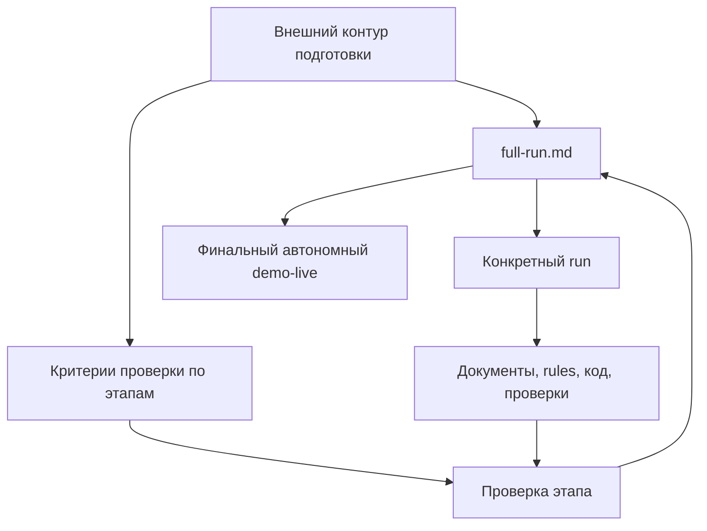
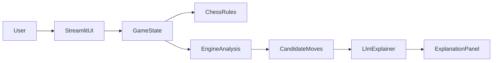

# Проект: Chess Coach

## Краткая идея
`Chess Coach` - это учебный шахматный сервис для живой презентации, в котором пользователь играет короткий фрагмент партии против движка, а `LLM` выступает не в роли игрока, а в роли понятного тренера-комментатора.

Продуктовая идея проста:

- движок отвечает за корректную шахматную механику и сильные ходы;
- `LLM` превращает сухой анализ в объяснение для человека;
- агент в `Cursor` позволяет быстро собрать такой сервис с нуля под управлением инженера.

## Формат рабочего пространства
Рабочая модель проекта разделяется на два уровня:

- корень текущего репозитория служит внешним контуром подготовки, где создаются master-документы, `full-run.md` как единый сценарий промптов, критерии проверки и заметки ревью;
- во время live-demo открывается только автономный `demo-live`;
- для репетиций и проверки создаются отдельные изолированные run-ы вне дерева внешнего проекта;
- каждый такой `run` моделирует одну полную презентацию и может быть остановлен после нужного этапа;
- каждый внутренний прогон стартует как отдельный автономный workspace без проектных артефактов; технические служебные файлы вроде `.git` допустимы, если они не подменяют проектные документы, правила, команды и код;
- любой внутренний прогон не должен знать о существовании внешнего контура и не должен содержать ссылок на него;
- все документы, `rules`, `agents`, `commands`, `hooks`, `skills` и код приложения должны создаваться внутри каждого внутреннего прогона пошагово через промпты, подготовленные заранее во внешнем контуре.

## Архитектура контуров и проверки

## Почему выбран именно этот проект
Этот проект хорошо подходит для демонстрации по четырем причинам:

1. Тема шахмат лично релевантна руководителю.
2. Результат визуально нагляден: доска, ходы, ответ движка, список лучших вариантов, текстовые объяснения.
3. Проект позволяет показать силу ИИ без ложной магии: модель не притворяется шахматным движком, а используется там, где она действительно полезна.
4. На этом кейсе легко показать, что без декомпозиции, ограничений и правильной постановки задач агент быстро начинает ошибаться.

## Пользовательский сценарий MVP
Пользователь открывает приложение и видит шахматную доску, текущее состояние партии и боковую панель анализа.

Дальше сценарий такой:

1. Пользователь делает свой ход.
2. Приложение проверяет легальность хода и обновляет позицию.
3. Движок рассчитывает ответ, оценку позиции и несколько лучших кандидатных ходов для игрока.
4. `LLM` получает уже подготовленные данные анализа и объясняет:
   - почему лучший ход силен;
   - какие идеи стоят за альтернативами;
   - какие риски или позиционные уступки возникают;
   - как на эту позицию стоит смотреть человеку.
5. Пользователь делает следующий ход и цикл повторяется.

## Состав MVP
В первую версию обязательно входят:

- локально запускаемое приложение на `Streamlit`;
- шахматная позиция и состояние партии в Python;
- интеграция с `Stockfish` или совместимым движком;
- возможность сделать ход и получить корректный ответ соперника;
- вывод топ-ходов для игрока;
- объяснение ходов через облачную `LLM`;
- интерфейс, пригодный для показа в live-demo.

## Архитектура приложения внутри внутреннего контура

## Роли компонентов
### `Streamlit UI`
Отвечает за доску, элементы управления, отображение позиции, истории ходов и блока объяснений.

### `Game State`
Хранит текущее состояние партии, очередь хода, историю и выбранные пользователем действия.

### `Chess Rules / Engine`
Отвечает за легальность ходов, генерацию ответного хода соперника, поиск сильнейших продолжений и оценку позиции.

### `LLM Explainer`
Получает не сырую позицию как единственный источник данных, а уже структурированный результат анализа движка. На его основе формирует понятное объяснение в обучающем стиле.

## Поэтапный цикл проверки
Надежность этой схемы должна подтверждаться не одним полным прогоном, а последовательностью промежуточных проверок.

Это означает:

- у каждого этапа есть собственный раздел в `full-run.md`;
- у каждого этапа есть собственный критерий готовности и список ожидаемых артефактов;
- внешний контур соотносит префикс промптов из `full-run.md` с наблюдаемым состоянием конкретного run-а: структурой файлов, созданными правилами, командами запуска, smoke-check и поведением UI;
- bootstrap-этап 2 принимается прямой проверкой запускаемого каркаса, конфигурационных заготовок и команды старта;
- сразу после написания или изменения кода на каждом следующем завершенном кодовом этапе внутри автономного `run` или `demo-live` сначала выполняется короткая автоматическая проверка, которая подтверждает, что проект не сломан на базовом уровне;
- сразу после написания или изменения кода на каждом следующем завершенном кодовом этапе внутри workflow родительского агента в автономном `run` или `demo-live` запускается свежий независимый проверяющий субагент, который оценивает результат по текущим артефактам проекта и по исходному промпту этапа из `full-run.md`, а не по памяти о предыдущем чате или промежуточному плану;
- если субагент выдает замечания, родительский агент вносит минимальные исправления, повторяет быстрый check и снова запускает субагента, пока не получит `PASS` без замечаний;
- во внешнем `meta-workspace` master-документы, сценарии и критерии ревьюятся напрямую по их тексту и связанным артефактам run-а; запуск этого субагента там не требуется, как и отдельный повторный запуск или специально сохраненный артефакт `PASS`, если итоговое состояние run-а соответствует этапу;
- если этап не принят, корректируется соответствующий раздел в `full-run.md`, и следующий прогон начинается заново из нового чистого run-а;
- финальный `demo-live` считается успешным только после того, как предыдущие этапы уже подтверждены встроенной приемкой соответствующих кодовых шагов и внешним сверением по текущим артефактам.

## Почему это сильнее, чем "LLM играет в шахматы"
Если поручить модели самой играть и объяснять, демо станет уязвимым:

- модель может предложить нелегальный ход;
- модель может плохо считать тактику;
- модель может уверенно объяснять ошибочное решение.

В выбранной концепции эти риски снимаются архитектурно. Это важно для презентации, потому что подчеркивает ключевой тезис: сильный результат получается не из-за слепой веры в ИИ, а из-за грамотного распределения ответственности.

## Что сознательно не делаем в MVP
Чтобы уложиться в час и сохранить надежность, в первую версию не входят:

- учетные записи;
- сохранение партий;
- дебютный репертуар;
- импорт `PGN`;
- продвинутые режимы тренировок;
- сложная анимация доски;
- многошаговые сценарии обучения;
- самостоятельная игра `LLM` без движка.

## Что особенно важно показать руководителю
Во время реализации и показа этот проект должен служить не только продуктовым demo, но и демонстрацией процесса:

- как из отдельного автономного workspace пошагово собирается рабочий проект;
- как после каждого этапа можно остановиться и проверить, что проект все еще движется в нужную сторону;
- как независимый проверяющий субагент со свежим контекстом снижает риск того, что основной агент сам себе "подтвердит" ошибочный результат;
- как инженер задает рамки для агента;
- как формируется узкий MVP вместо "сделай мне весь сервис";
- как определяется, что должен делать алгоритмический компонент, а что - языковая модель;
- как `rules`, `hooks`, `skills` и `MCP` встраиваются в инженерный процесс, а не используются как декоративные опции;
- как документация и промежуточные артефакты удерживают общий контекст команды агентов.

## Как проект помогает показать инструменты `Cursor`
Этот проект удобен тем, что каждый инструмент можно продемонстрировать на естественном, а не искусственном шаге:

- `rules` показываются как постоянные рамки проекта до начала реализации;
- проверяющий субагент показывается как независимый итеративный контур приемки начиная со следующего кодового этапа после базового runnable-каркаса;
- `skills` показываются при быстром создании или уточнении проектного правила без ручного изобретения формата;
- `MCP` показывается в момент, когда нужна актуальная документация по `Streamlit`, HTTP API или SDK облачной модели;
- `hooks` показываются после появления рабочего вертикального среза как автоматическая проверка после изменений.

## Формула ценности демонстрации
Проект должен производить у руководителя ровно такое впечатление:

`ИИ действительно очень ускоряет разработку, но высокий результат получается только тогда, когда им управляет человек, который умеет мыслить как инженер.`
